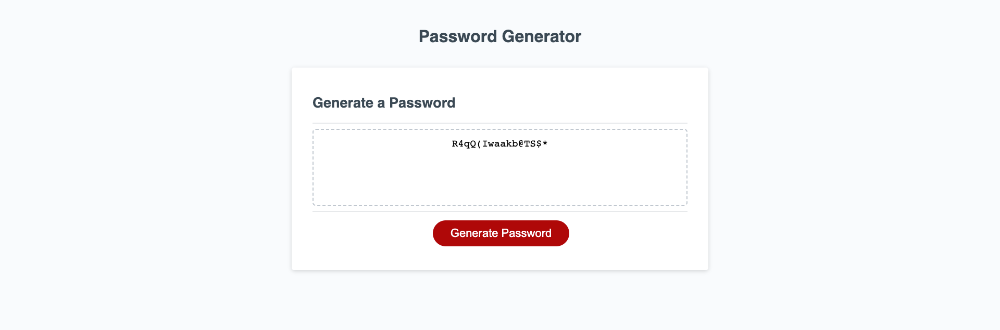

# Best-Password-Generator-TM-

## Technology Used 

| Technology Used         | Resource URL           | 
| ------------- |:-------------:| 
| HTML    | [https://developer.mozilla.org/en-US/docs/Web/HTML](https://developer.mozilla.org/en-US/docs/Web/HTML) | 
| CSS     | [https://developer.mozilla.org/en-US/docs/Web/CSS](https://developer.mozilla.org/en-US/docs/Web/CSS)      |   
| Git | [https://git-scm.com/](https://git-scm.com/)     | 
| JavaScript | [https://developer.mozilla.org/en-US/docs/Web/JavaScript](https://developer.mozilla.org/en-US/docs/Web/JavaScript)|


## Description

[Visit to Deployed Site](https://thomasmunzar.github.io/Best-Password-Generator-TM-/)

This projects goal was to create a password simulator for any user who would like to create a highly protected password.  When visiting the site the 
user will interact with a button that says "Generate Password" after clicking on the butting the user can enter the amount of characters AND type of characters that they
would like to make up their new password. Once they pick all the characters and length of the word a password will be generated for them.


Here is a look at what the site looks like when we generated a 16 charachter password:




This was a tough project. I was luckily given a very nice and simple CSS and HTML file so my focus was making the webpage interactive using JavaScript (JS).
I am struggling with JS right now, it is a complex language. However, working on this project helped me explore questions and find answer that taught me alot.

for instance:

we were given this snippet of code in out JS file:

```javascript

function generatePassword(){}


```
and i started making all of my [alerts, prompts, and if statements and for loop ] outside of this function. Which led to a faulty webpage that didnt work and led to me scratching and banging my head.

After a break and some research I learned that I need to put all my items in the generatePassword function in order for them to target that function (im not sure if that is how to word it...still learning the language on how to explain code).

anyways it ended up looking like this all pretty and nested:

```javascript
function generatePassword(){
  let passwordLength = parseInt(prompt("Pick password length. Must be between 8 and 128 characters):"));
 
  while (passwordLength < 8 || passwordLength > 128 || isNaN(passwordLength)){
    alert("INVALID! Please enter a number between 8 and 128");
    passwordLength = parseInt(prompt("Please enter number between 8 and 128 characters):"));
  }
  

var includeUpperCase = confirm("Include Uppercase?");
var includeLowerCase = confirm("Include Lowercase?");

 var includeSpecialChar = confirm("Include Special Characters?");


var includeNumbers = confirm("Include Numbers?");
var availableChars = [];

if (includeUpperCase) {
  availableChars = availableChars.concat(upperCase)
};

if (includeLowerCase){
availableChars = availableChars.concat(lowerCase)
}

if (includeSpecialChar){
  availableChars = availableChars.concat(specialChar)
}


if (includeNumbers){
  availableChars =availableChars.concat(numbersChar)
};

if (availableChars.length === 0){
  alert("Please select at least one character type!")
};

var password =""

for (var i = 0; i < passwordLength;i++){
var randomChar = availableChars[Math.floor(Math.random()* availableChars.length)]
password += randomChar
}
return password
} 
```

I was able to figure out functions and things that needed to be done but I did not know how to put everything together and have them interact. Nesting was the trick.

## Learning Points

I still feel extremely unsure of JS. As enlightening this project was, it brought up just as much confusion.  I cannot say i am more confident with JS
and to be perfectly honest I need to read over this code and probably redo this project to really understand what i did. But I am proud that I was able to figure someting out.

## Author
Thomas Munzar

* [Portfolio](https://thomasmunzar.github.io/portfolio-thomas/)
* [LinkedIn](https://www.linkedin.com/in/thomas-munzar-659b51250/)
* [Github](https://github.com/ThomasMunzar)

##
Thank you to my fellow classmates, teachers, TA's, Tutors for helping me and creating a supportive community.

## License
MIT License

Copyright (c) [2023] [Thomas Munzar]

Permission is hereby granted, free of charge, to any person obtaining a copy
of this software and associated documentation files (the "Software"), to deal
in the Software without restriction, including without limitation the rights
to use, copy, modify, merge, publish, distribute, sublicense, and/or sell
copies of the Software, and to permit persons to whom the Software is
furnished to do so, subject to the following conditions:

The above copyright notice and this permission notice shall be included in all
copies or substantial portions of the Software.

THE SOFTWARE IS PROVIDED "AS IS", WITHOUT WARRANTY OF ANY KIND, EXPRESS OR
IMPLIED, INCLUDING BUT NOT LIMITED TO THE WARRANTIES OF MERCHANTABILITY,
FITNESS FOR A PARTICULAR PURPOSE AND NONINFRINGEMENT. IN NO EVENT SHALL THE
AUTHORS OR COPYRIGHT HOLDERS BE LIABLE FOR ANY CLAIM, DAMAGES OR OTHER
LIABILITY, WHETHER IN AN ACTION OF CONTRACT, TORT OR OTHERWISE, ARISING FROM,
OUT OF OR IN CONNECTION WITH THE SOFTWARE OR THE USE OR OTHER DEALINGS IN THE
SOFTWARE.
